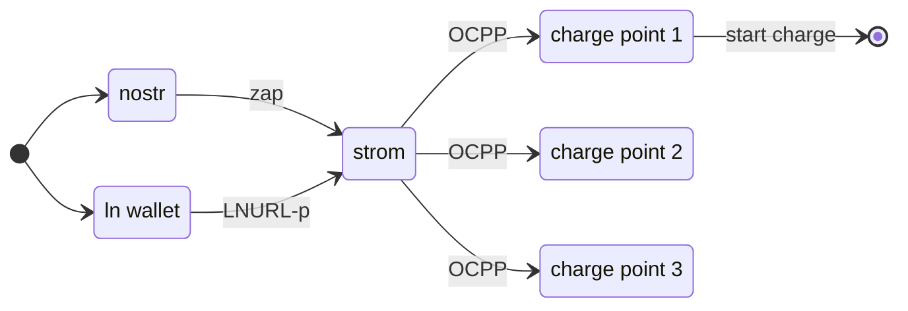

# strom - lightning/nostr enabled OCPP bridge

Strom is an open source application that allows charge point owners to accept lightning payments for charging sessions. It can be run locally to the charge point (e.g. on Umbrel) or on a hosted provider.

Each charge point added to Strom is configured with a unique nostr identity and [LNURL-p](https://github.com/lnurl/luds/blob/luds/06.md) address. A [static internet identifier](https://github.com/lnurl/luds/blob/luds/16.md) (lightning address) could also be configured. The LNURL-p address could then be advertised on the charge point in the form of a QR code or lightning address.

[Zapping](https://github.com/nostr-protocol/nips/blob/master/57.md) the nostr identity or making a payment to the LNURL-p/lightning address would initiate a charging session over OCPP, locking the cable and initiating communication with the vehicle.

As the state of the charge point changes from AVAILABLE to CHARGING, this status could be broadcast to a nostr relay as a [NIP-33 Replaceable Event](https://github.com/nostr-protocol/nips/blob/master/33.md).

If the session is initiated on nostr, details of the session could also be sent to the initiator via [NIP-04 Direct Message](https://github.com/nostr-protocol/nips/blob/master/04.md). This information could include the state of charge, session events, kWs charged and even prompt to continue charging with a follow-up zap.

### Charge Point Requirements

To communicate with the charge point, Strom will use [OCPP 1.6](https://github.com/mobilityhouse/ocpp/tree/master/docs/v16) over a websocket. OCPP allows Strom to manage the charge point configuration, monitor charging data and start/stop charge sessions.
