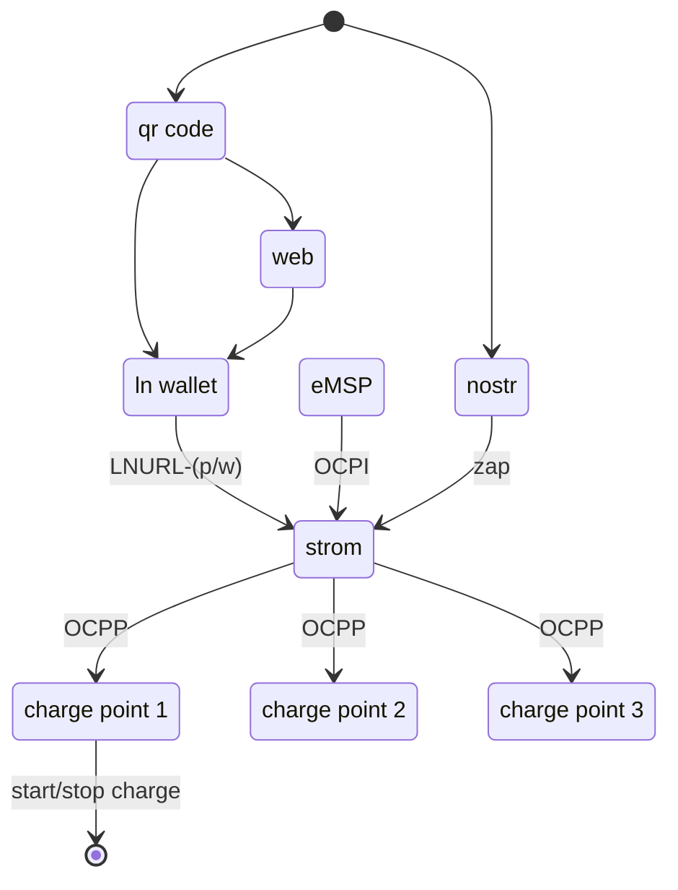

# strom - lightning/nostr enabled OCPP bridge

Strom is an open source application that allows charge point owners to accept lightning payments for charging sessions. It can be run locally to the charge point (e.g. on Umbrel) or on a hosted provider.

Each charge point added to Strom is configured with a unique [nostr](https://github.com/nostr-protocol/nostr) identity and [LNURL friendly](https://github.com/lnurl/luds/blob/luds/01.md#fallback-scheme) URL address. A [static internet identifier](https://github.com/lnurl/luds/blob/luds/16.md) (lightning address) could also be configured to initiate a charge. The LNURL friendly address could then be advertised on the charge point in the form of a QR code or lightning address. The address is formatted as a URI scheme that includes the LNURL as a query parameter and is otherwise a fallback URL to a web page.

The URL encoded in the LNURL address will return a [LNURL-p](https://github.com/lnurl/luds/blob/luds/06.md) or [LNURL-w](https://github.com/lnurl/luds/blob/luds/03.md) depending on if the charge point state is either AVAILABLE or CHARGING. 

Making a payment to the LNURL-p would initiate a charging session over OCPP, locking the cable and initiating communication with the vehicle. As part of the LNURL-p payment flow, Strom returns a [success action](https://github.com/lnurl/luds/blob/luds/09.md) with message and URL to view the session via a web page. 

When stopping the charge via LNURL-w, Strom needs to ensure that the initiator is the same as the LNURL-p payment so that someone else cannot stop the charge process or steal funds. Any prepaid amount that has not been consumed by charging can be refunded.

### Nostr

A charge point would appear as an identity on nostr, possibly with profile information and branding. The physical and addressable location of the charge point could be advertised using [NIP-44 Geospatial Types](https://github.com/rossbates/nips/blob/master/44.md) to pinpoint the exact location.  As the state of the charge point changes from AVAILABLE to CHARGING, this status could be broadcast to a nostr relay as a [NIP-33 Replaceable Event](https://github.com/nostr-protocol/nips/blob/master/33.md).

[Zapping](https://github.com/nostr-protocol/nips/blob/master/57.md) the nostr identity would initiate a charging session in the same way as described above, as zapping is an extended LNURL-p flow.

Details of the session could also be sent to the initiator via [NIP-04 Direct Message](https://github.com/nostr-protocol/nips/blob/master/04.md). This information could include the state of charge, session events, kWs charged and even prompt to continue charging with a follow-up zap. Also as a direct message the LNURL-w URL could be shared to stop the charge.

### Dynamic Pricing

Lightning payments or pre-payment enable a pricing model otherwise not possible. The tariffs defined in Strom could be set to a static payment structure or dynamically priced based on external data like energy spot markets or dynamic energy contract. Tariff information whether static or dynamic should be transparent to the end user.

### Charge Point Requirements

To communicate with the charge point, Strom will use [OCPP 1.6](https://github.com/mobilityhouse/ocpp/tree/master/docs/v16) (Open Charge Point Protocol) over a websocket. OCPP allows Strom to manage the charge point configuration, monitor charging data and start/stop charge sessions.

### OCPI Extension

Strom could also be extended to support [OCPI](https://github.com/ocpi/ocpi) (Open Charge Point Interface). This would allow eMSPs (e-Mobility Service Providers) to connect to a Strom instance to make the charge points managed publically available. To support only lightning payments, the OCPI specification could be extended with a module that supports payment streaming for ongoing sessions. Otherwise the OCPI tariffs could be defined in BTC and payment made once the session is finished and the CDR is received.

## Roadmap

- [x] Project framework
- [x] OCPP 1.6 core
- [ ] LND backend
- [ ] Basic Admin UI
- [ ] REST API
- [ ] Static tariff management
- [ ] Public charge point UI
- [ ] LNURL session management
- [ ] Nostr session management
- [ ] Umbrel app integration
- [ ] Second Lightning backend
- [ ] Websocket UI
- [ ] Dynamic tariff management
- [ ] OCPI extension
